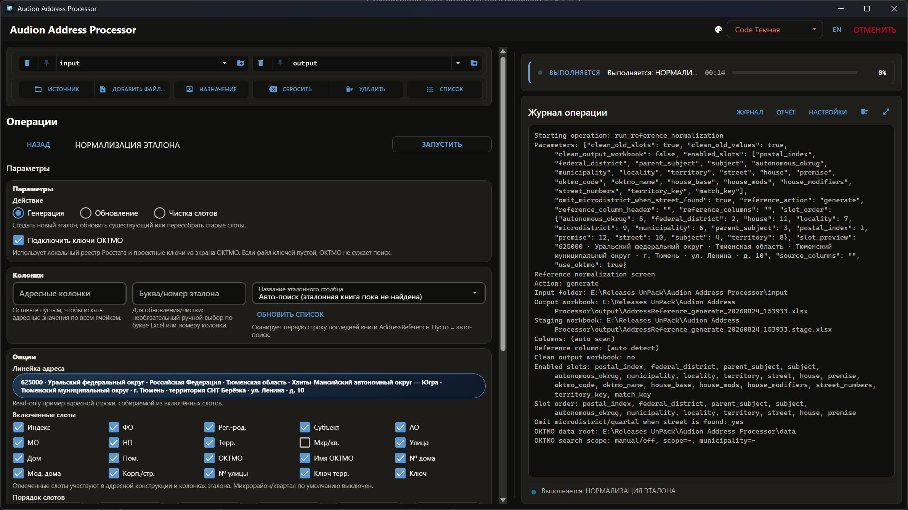

# Audion Address Processor

<!-- audion:release -->

  
  
  
  

**Версия 1.7.4** · 2026-09-04 · 218.3 MB

- [Скачать напрямую](https://audion.dev/get/address-processor/1.7.4/Audion_Address_Processor_v1.7.4_Full.zip) — быстрая раздача, без ограничений
- [Страница проекта](https://audion.dev/downloads/address-processor) — все версии и установка

`SHA-256: f7be1f313fa315cd40b4b3aeba2e15f7fb604f2cfd5adfe9d9c1a062979e40e3`

---

Проект набора **Audion** — издаёт [Tensionix](https://github.com/Tensionix).
<!-- /audion:release -->

[English](docs/README_EN.md) · [Руководство](docs/USER_GUIDE_RU.md) · [ОКТМО](docs/OKTMO_RU.md) · [Справочник](docs/REFERENCE_RU.md) · [Установка](docs/INSTALL_RU.md)

**Содержание**

- [Зачем это сделано](#зачем-это-сделано)
- [Как решается](#как-решается)
- [Что умеет](#что-умеет)
- [Принципы](#принципы)
- [Документация](#документация)
- [Техническая часть](#техническая-часть)

Работа с российскими адресными данными: сопоставление таблиц по адресу, сборка
чистых адресов из разнородных источников, эталонный справочник, коды территорий,
сортировка и разбор на составляющие.

## Зачем это сделано

Адрес — худшее, по чему можно сводить таблицы, и одновременно единственное, что
есть в большинстве муниципальных данных.

Один и тот же дом в двух выгрузках выглядит так: `г. Сургут, ул. Ленина, д. 12`
и `Сургут, Ленина 12`. Или `пр-т Мира, 5к1` и `проспект Мира, дом 5, корпус 1`.
Или в одной таблице адрес в одном столбце, а в другой разложен на четыре.

Сопоставление по точному совпадению даст десять процентов попаданий. Сравнение
на глазок — час работы на сотню строк и ошибки, которые никто не заметит.

## Как решается

**Пять этапов сопоставления с уточняющими проходами, от строгого к мягкому.**
Строка ищет пару сначала точным совпадением, затем по разобранным составляющим,
затем по приведённому к общему виду отпечатку, и лишь потом приблизительно.

Порядок не случаен: **строгое совпадение никогда не проигрывает приблизительному**.
Если дом нашёлся точно, мягкий поиск уже не рассматривается — иначе похожая
строка из соседнего района перебьёт верную. Найденная пара сразу изымается из
пула кандидатов, поэтому один и тот же дом не может быть выдан дважды.

Полный разбор проходов — в [Справочнике](docs/REFERENCE_RU.md#проходы-сопоставления).

## Что умеет

**Выравнивать таблицы** по эталонному адресному столбцу — и переносить рядом
стоящие столбцы вместе с адресами, чтобы данные не разъехались.

**Собирать чистые адреса** из чего угодно: таблиц, документов Word и ODT,
текста, CSV, разметки и PDF с текстовым слоем.

**Вести эталонный справочник** со слотами: индекс, муниципалитет, населённый
пункт, улица, дом, код территории и технические ключи.

**Сортировать и разбирать** справочник по выбранной иерархии слотов — от региона
к дому или в любом другом порядке.

**Переносить колонки между книгами** по адресу дома — не копированием строк, а
через Excel, с сохранением формул, оформления, листов и порядка строк основной
книги.

**Опираться на реестр ОКТМО Росстата.** Регион и муниципалитет выбираются из
официального реестра, названия населённых пунктов раскрываются в падежные формы
и сужают поиск до нужной территории. Реестр скачивается кнопкой прямо из окна —
см. [ОКТМО](docs/OKTMO_RU.md).

**Читать кривые шапки.** Двухуровневый заголовок собирается целиком: строка без
значений-данных, стоящая под объединённым родительским заголовком, считается
подзаголовком независимо от того, какими словами он написан. Столбец
«Проектная мощность, мест» над «по корпусам» становится
«Проектная мощность, мест по корпусам», а не безымянным `column_5`, и сама
строка подзаголовков не уезжает в данные.

## Принципы

**Исходники не меняются.** Результат всегда пишется в отдельную папку. Что
пришло — то и осталось.

**Столбцы задаются как в Excel.** `A`, `B`, `AC` — теми же буквами, что видны в
заголовке таблицы, а не порядковыми номерами.

**Настройки можно не править руками.** Всё лежит в файле настроек, но столбцы
безопасно задаются прямо в окне.

**Каждый прогон оставляет отчёт.** Рядом с результатом в `report/` появляется
JSON: что нашлось, чем нашлось, что осталось без пары.

**Таблица на выходе читаема.** Ширина столбцов подбирается по содержимому,
длинный текст переносится, высота строк растёт. Мелочь, но без неё выгрузку
приходится доводить руками каждый раз.

## Документация

| Документ | О чём |
| --- | --- |
| [Руководство пользователя](docs/USER_GUIDE_RU.md) | Окно, рабочие папки, все команды по шагам |
| [ОКТМО и ключи проекта](docs/OKTMO_RU.md) | Реестр Росстата, скачивание, обновление, кэш, ключи, пины |
| [Технический справочник](docs/REFERENCE_RU.md) | Слоты, проходы сопоставления, настройки, отчёты |
| [Установка и запуск](docs/INSTALL_RU.md) | Portable-окружение, launcher-файлы, обслуживание |
| [Карта файлов проекта](docs/tools/PROJECT_FILES_GUIDE_RU.md) | Где что лежит в исходниках |

---

## Техническая часть

### Источники

`.xlsx`, `.docx`, `.odt`, `.txt`, `.csv`, `.md` и `.pdf` с текстовым слоем.
Старые `.doc` и `.xls` конвертируются отдельной командой.

### Настройки

`config/project.yaml`. В окне доступны безопасные поля для столбцов — файл
править не обязательно.

### Диагностика

Отдельный разбор работы обработчика и безопасная очистка полностью пустых
строк — без риска зацепить строки с данными в одном столбце.
